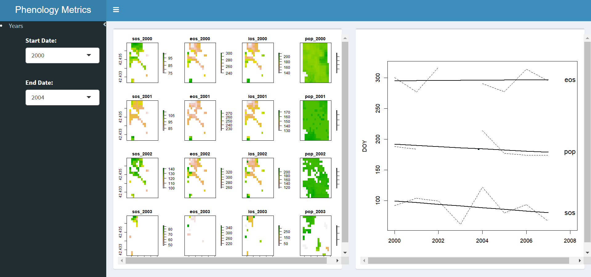
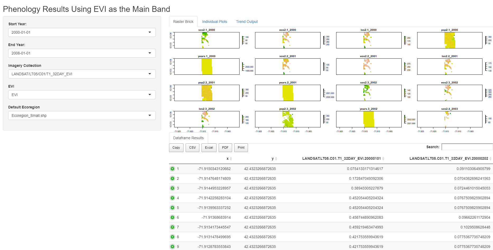

<!--
*** Thanks for checking out the Best-README-Template. If you have a suggestion
*** that would make this better, please fork the repo and create a pull request
*** or simply open an issue with the tag "enhancement".
*** Thanks again! Now go create something AMAZING! :D
-->


<!-- PROJECT SHIELDS -->
<!--
*** I'm using markdown "reference style" links for readability.
*** Reference links are enclosed in brackets [ ] instead of parentheses ( ).
*** See the bottom of this document for the declaration of the reference variables
*** for contributors-url, forks-url, etc. This is an optional, concise syntax you may use.
*** https://www.markdownguide.org/basic-syntax/#reference-style-links
-->
[![Contributors][contributors-shield]][contributors-url]
[![Forks][forks-shield]][forks-url]
[![Stargazers][stars-shield]][stars-url]
[![Issues][issues-shield]][issues-url]
[![MIT License][license-shield]][license-url]
[![LinkedIn][linkedin-shield]][linkedin-url]
[![LinkedIn2][linkedin-shield2]][linkedin-url2]


<!-- PROJECT LOGO -->
<br />
<p align="center">
  <a href="https://github.com/othneildrew/Best-README-Template">
    
  </a>

  <h3 align="center">Best-README-Template</h3>

  <p align="center">
    An awesome README template to jumpstart your projects!
    <br />
    <a href="https://github.com/othneildrew/Best-README-Template"><strong>Explore the docs »</strong></a>
    <br />
    <br />
    <a href="https://github.com/othneildrew/Best-README-Template">View Demo</a>
    ·
    <a href="https://github.com/othneildrew/Best-README-Template/issues">Report Bug</a>
    ·
    <a href="https://github.com/othneildrew/Best-README-Template/issues">Request Feature</a>
  </p>
</p>


# Phenology with GEE and R

<!-- TABLE OF CONTENTS -->
<details open="open">
  <summary>Table of Contents</summary>
  <ol>
    <li>
      <a href="#about-the-project">About The Project</a>
      <ul>
        <li><a href="#built-with">Built With</a></li>
      </ul>
    </li>
    <li>
      <a href="#getting-started">Getting Started</a>
      <ul>
        <li><a href="#prerequisites">Prerequisites</a></li>
        <li><a href="#installation">Installation</a></li>
      </ul>
    </li>
    <li><a href="#usage">Usage</a></li>
    <li><a href="#roadmap">Roadmap</a></li>
    <li><a href="#contributing">Contributing</a></li>
    <li><a href="#license">License</a></li>
    <li><a href="#contact">Contact</a></li>
    <li><a href="#acknowledgements">Acknowledgements</a></li>
  </ol>
</details>


### Objective
- Phenology is described as the study of timing of different event such as flowering, leafing, and migrations
- The goal of our project is to develop essential biodiversity variables using Google Earth Engine to extract and analyze phenological metrics to explore trends over  time using two key packages `RGEE` and `GreenBrown`. 
- The metrics we are extracting follows
    1. Start of season (SOS)
    2. End of season (EOS), 
    3. Point of peak value (POP)
    4. Length of season(LOS)

### RGEE

#Insert Image Here

## What is Google Earth Engine?

[Google Earth Engine](https://earthengine.google.com/) is a cloud-based platform that allows users to have an easy access to a petabyte-scale archive of remote sensing data and run geospatial analysis on Google’s infrastructure. Currently, Google offers support only for Python and JavaScript. `rgee` will fill the gap **starting to provide support to R\!**. Below you will find the comparison between the syntax of `rgee` and the two Google-supported client libraries.

<table>
<tr>
<th> JS (Code Editor) </th>
<th> Python </th>
<th> R </th>
</tr>
<tr>
<td>
  
``` javascript
var db = 'CGIAR/SRTM90_V4'
var image = ee.Image(db)
print(image.bandNames())
#> 'elevation'
```

</td>
<td>

``` python
import ee
ee.Initialize()
db = 'CGIAR/SRTM90_V4'
image = ee.Image(db)
image.bandNames().getInfo()
#> [u'elevation']
```

</td>
<td>

``` r
library(rgee)
ee_Initialize()
db <- 'CGIAR/SRTM90_V4'
image <- ee$Image(db)
image$bandNames()$getInfo()
#> [1] "elevation"
```
</td>
</tr>
</table>

**Quite similar, isn’t it?**. However, there are additional smaller changes should consider when using Google Earth Engine with R. Please check the [consideration section](https://r-spatial.github.io/rgee/articles/considerations.html) before you start coding\!

## Installation

Install the `rgee` package from GitHub is quite simple, you just have to run in your R console as follows:

``` r
remotes::install_github("r-spatial/rgee")
```

**`rgee` depends on [sf](https://github.com/r-spatial/sf)**. Therefore, is necessary to install its external libraries, follow the installation steps specified [here](https://github.com/r-spatial/sf#installing). If you are using a Debian-based operating system, you probably need to install **virtualenv** as well.

```
sudo pip3 install virtualenv
```

## setup

Prior to using `rgee` you will need to install a **Python version higher than 3.5** in their system. `rgee` counts with an installation function (ee_install) which helps to setup `rgee` correctly:

```r
library(rgee)

## It is necessary just once
ee_install()

# Initialize Earth Engine!
ee_Initialize()
```

Additionally, you might use the functions below for checking the status of rgee dependencies and delete credentials.

```r
ee_check() # Check non-R dependencies
ee_clean_credentials() # Remove credentials of a specific user
ee_clean_pyenv() # Remove reticulate system variables
```

### GreenBrown

#Insert Image Here
```r
#Install greenbrown
install.packages("greenbrown", repos="http://R-Forge.R-project.org")
library(greenbrown)
```

### Required Packages

```r
# using("shiny","ggplot2","sf","sp", "tidyverse", "raster", "qdapRegex", "lubridate", "doParallel", "foreach","parallel", "gsubfn","rgee", "reticulate", "rgdal", "magrittr", "kimisc")
```


## Product Updates 

### Fall 2020 Product
Following our work from this semester, we are able to extract these metrics for over 7 years from 2000-2007 using only EVI and one site and visualize it on a shiny app which is hosted online on github for people to download and utilize. 

    
### Dashboard Application 



### Shiny App Application 



## Future Work

### Spring 2020 End Product: 
Google Earth Engine App that allows the user to select an input region and extract these metrics based on user input:
Imagery Collection
Dates
Desired Metric


## Sources

#### RGEE
https://csaybar.github.io/rgee-examples/#What%20is%20rgee%3f
https://github.com/MVanDenburg92/RGEE_Workshop

#### Greenbrown
http://greenbrown.r-forge.r-project.org/index.php

#### Project Links
http://earthobservations.org/article.php?id=447
https://eodatascience.com/About/Company-Overview

#### Phenology
https://www.youtube.com/watch?v=RNs3XpRmRfI

!-- MARKDOWN LINKS & IMAGES -->
<!-- https://www.markdownguide.org/basic-syntax/#reference-style-links -->
[contributors-shield]: https://img.shields.io/github/contributors/othneildrew/Best-README-Template.svg?style=for-the-badge
[contributors-url]: https://github.com/MVanDenburg92/RGEE_Shiny/graphs/contributors
[forks-shield]: https://img.shields.io/github/forks/othneildrew/Best-README-Template.svg?style=for-the-badge
[forks-url]: https://github.com/MVanDenburg92/RGEE_Shiny/network/members
[stars-shield]: https://img.shields.io/github/stars/MVanDenburg92/RGEE_Shiny?style=for-the-badge
[stars-url]: https://github.com/MVanDenburg92/RGEE_Shiny/stargazers
[issues-shield]: https://img.shields.io/github/issues/othneildrew/Best-README-Template.svg?style=for-the-badge
[issues-url]: https://github.com/MVanDenburg92/RGEE_Shiny/issues
[license-shield]: https://img.shields.io/github/license/othneildrew/Best-README-Template.svg?style=for-the-badge
[license-url]: https://github.com/othneildrew/Best-README-Template/blob/master/LICENSE.txt
[linkedin-shield]: https://img.shields.io/badge/-LinkedIn-black.svg?style=for-the-badge&logo=linkedin&colorB=555
[linkedin-url]: https://www.linkedin.com/in/miles-van-denburg-14068597/
[linkedin-shield2]: https://img.shields.io/badge/-LinkedIn-black.svg?style=for-the-badge&logo=linkedin&colorB=555
[linkedin-url2]: https://www.linkedin.com/in/shreena-pyakurel-9b015010a/
[product-screenshot]: images/screenshot.png
