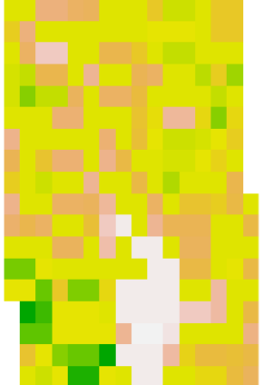
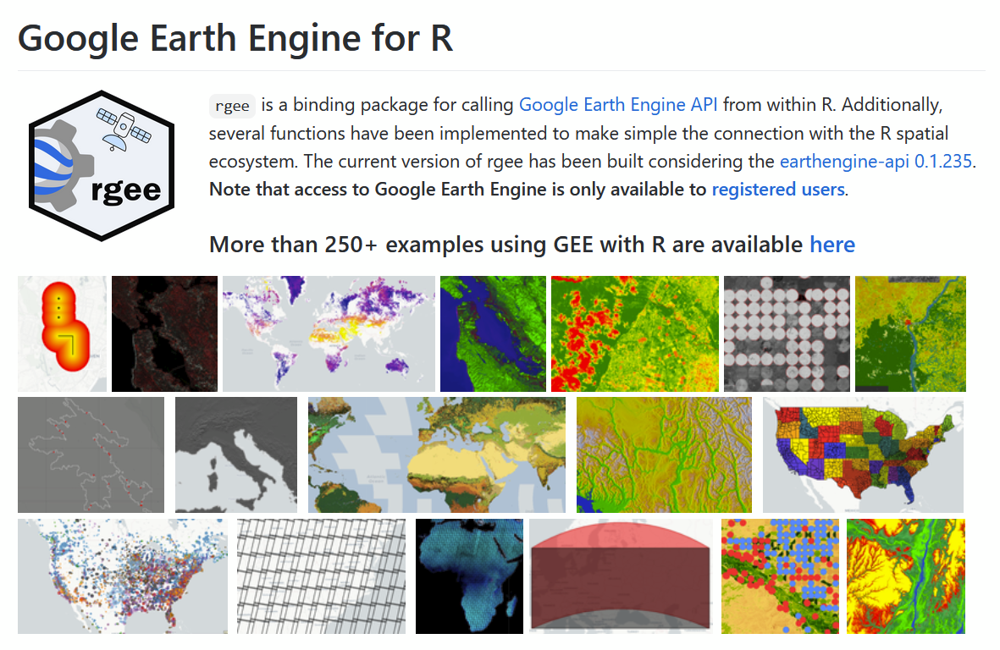
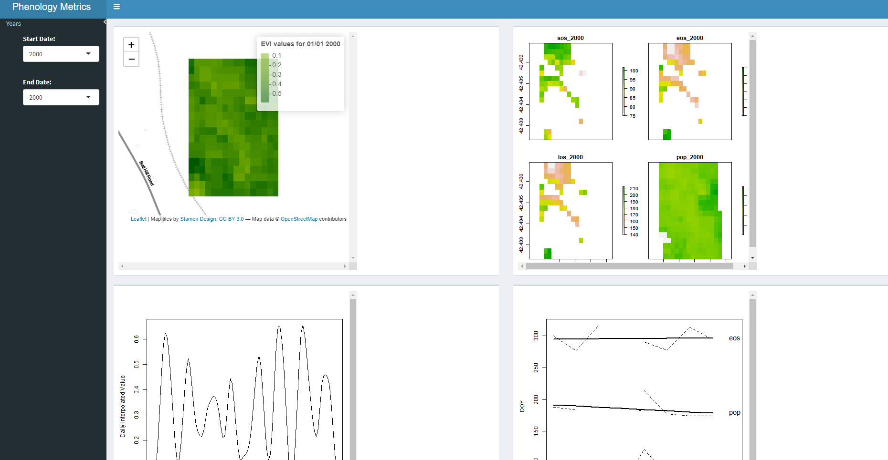

<!--
*** Thanks for checking out the Best-README-Template. If you have a suggestion
*** that would make this better, please fork the repo and create a pull request
*** or simply open an issue with the tag "enhancement".
*** Thanks again! Now go create something AMAZING! :D
-->


<!-- PROJECT SHIELDS -->
<!--
*** I'm using markdown "reference style" links for readability.
*** Reference links are enclosed in brackets [ ] instead of parentheses ( ).
*** See the bottom of this document for the declaration of the reference variables
*** for contributors-url, forks-url, etc. This is an optional, concise syntax you may use.
*** https://www.markdownguide.org/basic-syntax/#reference-style-links
-->
[![Contributors][contributors-shield]][contributors-url]
[![Forks][forks-shield]][forks-url]
[![Stargazers][stars-shield]][stars-url]
[![Issues][issues-shield]][issues-url]
[![MIT License][license-shield]][license-url]
[![LinkedIn][linkedin-shield]][linkedin-url]
[![LinkedIn2][linkedin-shield2]][linkedin-url2]


<!-- PROJECT LOGO -->
<br />
<p align="center">
  <a href="https://github.com/MVanDenburg92/RGEE_Shiny/blob/main/README.md">
    
  </a>

  <h1 align="center">Phenology Analyses with GEE and R</h1>

  <p align="center">
    Two case examples of Phenological imagery analysis with R and Google Earth Engine
    <br />
    <a href="#about-the-project"><strong>Explore the docs»</strong></a>
    <br />
    <br />
    <a href="https://github.com/MVanDenburg92/RGEE_Shiny">View Demo</a>
    .
    <a href="https://github.com/MVanDenburg92/RGEE_Shiny/issues">Report Bug</a>
    ·
    <a href="https://github.com/MVanDenburg92/RGEE_Shiny/issues">Request Feature</a>
  </p>
</p>


<!-- TABLE OF CONTENTS -->
<details open="open">
  <summary>Table of Contents</summary>
  <ol>
    <li>
      <a href="#about-the-project">About The Project</a>
      <ul>
        <li><a href="#built-with">Built With</a></li>
      </ul>
    </li>
    <li>
      <a href="#getting-started">Getting Started</a>
      <ul>
        <li><a href="#prerequisites">Prerequisites</a></li>
        <li><a href="#required-packages">Required Packages</a></li>
        <li><a href="#installation">Installation</a></li>
      </ul>
    </li>
    <li><a href="#usage">Usage</a></li>
    <li><a href="#roadmap">Roadmap</a></li>
    <li><a href="#contributing">Contributing</a></li>
    <li><a href="#future-work">Future Work</a></li>
    <li><a href="#contact">Contact</a></li>
    <li><a href="#acknowledgements">Sources</a></li>
  </ol>
</details>

## About the Project 

Last year, GEO and Google Earth Engine announced a call to action for Earth observations projects monitoring the pulse of the planet to apply for the GEO-GEE Programme. More than 50 projects were submitted from around the globe on a range of social and environmental topics including climate monitoring, water and coastal observations, sustainable development and other key areas related to environmental protection and conservation. 

As one of the teams with a winning proposal, we begin a two-year journey to produce tangible societal benefits using the power of Earth observations coupled to Google Earth Engine. In partnership with EO Data Science, we are receiving in-kind technical support, mentoring and ongoing capacity development to ensure projects achieve their intended impact.  

### Objective
- Phenology is described as the study of timing of different event such as flowering, leafing, and migrations
- The goal of our project is to develop essential biodiversity variables using Google Earth Engine to extract and analyze phenological metrics to explore trends over  time using two key packages `RGEE` and `GreenBrown`. 
- The metrics we are extracting follows
    1. Start of season (SOS)
    2. End of season (EOS), 
    3. Point of peak value (POP)
    4. Length of season(LOS)

## Built With

* [RGEE](https://csaybar.github.io/rgee-examples/#What%20is%20rgee%3f)
* [Greenbrown](http://greenbrown.r-forge.r-project.org/index.php)
* [R Shiny](https://laravel.com)

<!-- GETTING STARTED -->
## Getting Started

This is an example of how you may give instructions on setting up your project locally.
To get a local copy up and running follow these simple example steps.

### Prerequisites

You need to have an R version of 4.0 or greater and an updated R studio. In addition you will need the following packages: 
#### Required Packages

```r
#
"shiny","ggplot2","sf","sp", "tidyverse", "raster", "qdapRegex", "lubridate", "doParallel", "foreach","parallel", "gsubfn","rgdal", "magrittr", "kimisc"
```
You cane quickly check for them and install them by using the below function:

```r
using<-function(...) {
    libs<-unlist(list(...))
    req<-unlist(lapply(libs,require,character.only=TRUE))
    need<-libs[req==FALSE]
    n<-length(need)
    if(n>0){
        libsmsg<-if(n>2) paste(paste(need[1:(n-1)],collapse=", "),",",sep="") else need[1]
        print(libsmsg)
        if(n>1){
            libsmsg<-paste(libsmsg," and ", need[n],sep="")
        }
        libsmsg<-paste("The following packages could not be found: ",libsmsg,"\n\r\n\rInstall missing packages?",collapse="")
        if(winDialog(type = c("yesno"), libsmsg)=="YES"){       
            install.packages(need)
            lapply(need,require,character.only=TRUE)
        }
    }
}

using("shiny","ggplot2","sf","sp", "tidyverse", "raster", "qdapRegex", "lubridate", "doParallel", "foreach","parallel", "gsubfn","rgdal", "magrittr", "kimisc")


```
  
### RGEE



#### What is Google Earth Engine?

[Google Earth Engine](https://earthengine.google.com/) is a cloud-based platform that allows users to have an easy access to a petabyte-scale archive of remote sensing data and run geospatial analysis on Google’s infrastructure. Currently, Google offers support only for Python and JavaScript. `rgee` will fill the gap **starting to provide support to R\!**. Below you will find the comparison between the syntax of `rgee` and the two Google-supported client libraries.

<table>
<tr>
<th> JS (Code Editor) </th>
<th> Python </th>
<th> R </th>
</tr>
<tr>
<td>
  
``` javascript
var db = 'CGIAR/SRTM90_V4'
var image = ee.Image(db)
print(image.bandNames())
#> 'elevation'
```

</td>
<td>

``` python
import ee
ee.Initialize()
db = 'CGIAR/SRTM90_V4'
image = ee.Image(db)
image.bandNames().getInfo()
#> [u'elevation']
```

</td>
<td>

``` r
library(rgee)
ee_Initialize()
db <- 'CGIAR/SRTM90_V4'
image <- ee$Image(db)
image$bandNames()$getInfo()
#> [1] "elevation"
```
</td>
</tr>
</table>

**Quite similar, isn’t it?**. However, there are additional smaller changes should consider when using Google Earth Engine with R. Please check the [consideration section](https://r-spatial.github.io/rgee/articles/considerations.html) before you start coding\!

#### Installation

Install the `rgee` package from GitHub is quite simple, you just have to run in your R console as follows:

``` r
remotes::install_github("r-spatial/rgee")
```

**`rgee` depends on [sf](https://github.com/r-spatial/sf)**. Therefore, is necessary to install its external libraries, follow the installation steps specified [here](https://github.com/r-spatial/sf#installing). If you are using a Debian-based operating system, you probably need to install **virtualenv** as well.

```
sudo pip3 install virtualenv
```

#### Setup

Prior to using `rgee` you will need to install a **Python version higher than 3.5** in their system. `rgee` counts with an installation function (ee_install) which helps to setup `rgee` correctly:

```r
library(rgee)

## It is necessary just once
ee_install()

# Initialize Earth Engine!
ee_Initialize()
```

Additionally, you might use the functions below for checking the status of rgee dependencies and delete credentials.

```r
ee_check() # Check non-R dependencies
ee_clean_credentials() # Remove credentials of a specific user
ee_clean_pyenv() # Remove reticulate system variables
```

### GreenBrown


```r
#Install greenbrown
install.packages("greenbrown", repos="http://R-Forge.R-project.org")
library(greenbrown)
```


### Getting the Apps to Run 

After you get the prerequisite packages installed followed up by rgee and greenbrown, the next step is to get the app scripts!  Click on the app of interest and Copy the code  into an app.R script files within R studio. 

After you set up your Shiny Web App script, please run the following lines BEFORE running the App to correctly load up both rgee and the reticulate package (allows for python libraries and functions to be used within R). 

```r
library(rgee)
ee_Initialize()

#DO NOT RUN library( UNTIL YOU HAVE INTIALIZED GEE|  If you do, your system will brick because you need to define the python environment using rgee first.
library(reticulate)
```

Once you have these packages loaded up post-installation and initiallization, you are ready to run the app! Leave the code exactly how it is and click "Run App"!

## Product Updates 

### Fall 2020 Product
Following our work from this semester, we are able to extract these metrics for over 7 years from 2000-2007 using only EVI and one site and visualize it on a shiny app which is hosted online on github for people to download and utilize. 

    
### Dashboard Application 



### Shiny App Application 


## Future Work

### Spring 2020 End Product: 
Google Earth Engine App that allows the user to select an input region and extract these metrics based on user input:
Imagery Collection
Dates
Desired Metric

## Contact US

         .       
                
               Email: mvandenburg@clarku.edu                                 Email: spyakurel@clarku.edu

## Sources

#### RGEE
https://csaybar.github.io/rgee-examples/#What%20is%20rgee%3f
https://github.com/MVanDenburg92/RGEE_Workshop

#### Greenbrown
http://greenbrown.r-forge.r-project.org/index.php

#### Project Links
http://earthobservations.org/article.php?id=447
https://eodatascience.com/About/Company-Overview

#### Phenology
https://www.youtube.com/watch?v=RNs3XpRmRfI

!-- MARKDOWN LINKS & IMAGES -->
<!-- https://www.markdownguide.org/basic-syntax/#reference-style-links -->
[contributors-shield]: https://img.shields.io/github/contributors/MVanDenburg92/RGEE_Shiny?style=for-the-badge
[contributors-url]: https://github.com/MVanDenburg92/RGEE_Shiny/graphs/contributors
[forks-shield]: https://img.shields.io/github/forks/MVanDenburg92/RGEE_Shiny?label=Fork&style=for-the-badge
[forks-url]: https://github.com/MVanDenburg92/RGEE_Shiny/network/members
[stars-shield]: https://img.shields.io/github/stars/MVanDenburg92/RGEE_Shiny?style=for-the-badge
[stars-url]: https://github.com/MVanDenburg92/RGEE_Shiny/stargazers
[issues-shield]: https://img.shields.io/github/issues/MVanDenburg92/RGEE_Shiny?style=for-the-badge
[issues-url]: https://github.com/MVanDenburg92/RGEE_Shiny/issues
[license-shield]: https://img.shields.io/github/license/othneildrew/Best-README-Template.svg?style=for-the-badge
[license-url]: https://github.com/othneildrew/Best-README-Template/blob/master/LICENSE.txt
[linkedin-shield]: https://img.shields.io/badge/-LinkedIn-black.svg?style=for-the-badge&logo=linkedin&colorB=555
[linkedin-url]: https://www.linkedin.com/in/miles-van-denburg-14068597/
[linkedin-shield2]: https://img.shields.io/badge/-LinkedIn-black.svg?style=for-the-badge&logo=linkedin&colorB=555
[linkedin-url2]: https://www.linkedin.com/in/shreena-pyakurel-9b015010a/
[product-screenshot]: images/screenshot.png
